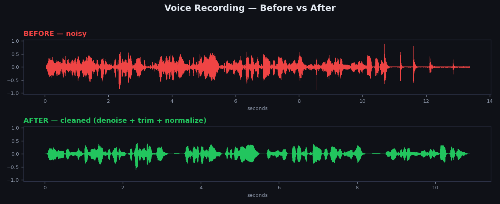
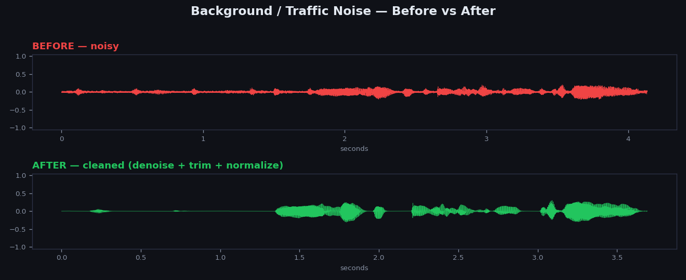

<div align="center">

# 🎙️ TTS Dataset Cleaner

### Turn noisy audio into clean, training-ready TTS datasets — in one command.

[](https://www.python.org/downloads/)
[](LICENSE)
[]()
[]()

**Bad audio = bad TTS models.** This tool removes background noise, trims silence, and normalizes loudness across your entire dataset — so your TTS model trains on clean, consistent speech.

[Quick Start](#-quick-start) · [Usage](#-usage) · [How It Works](#-how-it-works) · [Benchmarks](#-benchmarks) · [FAQ](#-faq)

</div>

---

## 💡 Why this exists

Training a good text-to-speech (TTS) model needs **clean audio**. Real-world recordings have background hum, fan noise, room echo, inconsistent volume, and dead air at the start and end of clips. Cleaning a dataset by hand is impossible at scale.

**TTS Dataset Cleaner** runs your whole dataset through a 3-stage pipeline automatically:

| Stage | What it does | Why TTS needs it |
|-------|-------------|------------------|
| 🔇 **Noise Removal** | Neural deep-learning denoiser | Clean speech = clean voice clones |
| ✂️ **Silence Trimming** | Cuts dead air from start & end | No awkward pauses in generated speech |
| 📊 **Loudness Norm** | Normalizes every file to -23 LUFS | Consistent volume = stable training |

Point it at a folder. Get back a clean dataset. That's it.

---

## 🎧 See & Hear the Difference

Real output from this tool. The waveforms show the constant noise floor removed and dead air trimmed — speech stays, everything else goes.

### 🗣️ Voice Recording



▶️ **Listen:** [Before (noisy)](demo/jeeva_before.ogg) · [After (cleaned)](demo/jeeva_after.wav)

### 🚗 Background / Traffic Noise



▶️ **Listen:** [Before (noisy)](demo/car_before.wav) · [After (cleaned)](demo/car_after.wav)

> Click a "Listen" link to play the audio directly on GitHub. Every "after" file is denoised, silence-trimmed, and normalized to -23 LUFS.

---

## ✨ Features

- 🚀 **One command** — `python clean.py --input ./data --output ./clean`
- 🧠 **Neural denoising** — state-of-the-art noise suppression, phase-aware (no robotic artifacts)
- 🎯 **Auto-detects** dataset format — LJSpeech, VCTK, or a plain folder of audio
- 📁 **Preserves structure** — keeps your `metadata.csv`, subfolders, and filenames intact
- 🖥️ **GPU or CPU** — runs anywhere; uses your GPU automatically if available
- 🌐 **Web UI included** — drag-and-drop a ZIP, download cleaned dataset
- 📋 **Detailed reports** — per-file stats, latency, failures
- 🎛️ **Fully configurable** — toggle any stage, tune loudness target & noise limits

---

## 🚀 Quick Start

### 1. Clone

```bash
git clone https://github.com/YOUR_USERNAME/tts-dataset-cleaner.git
cd tts-dataset-cleaner
```

### 2. Create a virtual environment

```bash
python -m venv venv

# Windows
venv\Scripts\activate

# Linux / macOS
source venv/bin/activate
```

### 3. Install PyTorch

**GPU (NVIDIA — recommended, much faster):**
```bash
pip install torch torchaudio --index-url https://download.pytorch.org/whl/cu121
```

**CPU only (works everywhere, slower):**
```bash
pip install torch torchaudio --index-url https://download.pytorch.org/whl/cpu
```

> Not sure which CUDA version you have? Run `nvidia-smi`. CUDA 12.x → use `cu121`. CUDA 11.x → use `cu118`.

### 4. Install the rest

```bash
pip install -r requirements.txt
```

### 5. Verify GPU (optional)

```bash
python -c "import torch; print('GPU:', torch.cuda.is_available())"
```

---

## 📖 Usage

### Command Line

**Basic — clean a folder:**
```bash
python clean.py --input ./my_dataset --output ./my_dataset_clean
```

**LJSpeech dataset (keeps metadata.csv):**
```bash
python clean.py --input ./LJSpeech-1.1 --output ./LJSpeech-clean
```

**Tune the pipeline:**
```bash
python clean.py \
  --input ./data \
  --output ./clean \
  --target-lufs -20 \      # louder output
  --atten-lim 15 \         # gentler noise removal (preserve more)
  --no-trim                # skip silence trimming
```

**All options:**

| Flag | Default | Description |
|------|---------|-------------|
| `--input` | *(required)* | Input folder (audio files or dataset) |
| `--output` | *(required)* | Output folder (created automatically) |
| `--no-pf` | off | Disable post-filter (faster, slightly less suppression) |
| `--atten-lim` | none | Limit noise reduction to N dB (preserves naturalness) |
| `--no-trim` | off | Skip silence trimming |
| `--no-norm` | off | Skip loudness normalization |
| `--target-lufs` | -23.0 | Loudness target (EBU R128 standard) |
| `--workers` | 1 | Parallel workers (keep at 1 for GPU) |

After running, check `output/cleaning_report.txt` for a full summary.

### Web UI (Gradio)

```bash
python app.py
```

Opens at `http://127.0.0.1:7860`. ZIP your dataset, drag it in, tweak the options, download the cleaned ZIP. Live progress bar and stats included.

---

## 🔬 How It Works

```
  Your noisy audio (any format, any sample rate)
                    │
                    ▼
        ┌───────────────────────┐
        │  1. Load & resample    │   →  48kHz (denoiser's native rate)
        │     to 48kHz           │
        └───────────┬───────────┘
                    ▼
        ┌───────────────────────┐
        │  2. Neural denoise     │   →  AI removes noise, keeps speech
        │     noise removal      │      (complex spectral filtering)
        └───────────┬───────────┘
                    ▼
        ┌───────────────────────┐
        │  3. Resample back      │   →  your original sample rate
        │     to original SR     │
        └───────────┬───────────┘
                    ▼
        ┌───────────────────────┐
        │  4. Trim silence       │   →  cut dead air, start & end
        └───────────┬───────────┘
                    ▼
        ┌───────────────────────┐
        │  5. Loudness normalize │   →  every file at -23 LUFS
        └───────────┬───────────┘
                    ▼
       Clean, consistent, training-ready audio ✅
```

**The denoiser:** the noise-removal core is a two-stage neural network. Stage 1 uses a lightweight GRU on perceptual ERB frequency bands for coarse noise removal. Stage 2 applies fine-grained complex filters only where speech lives. Because it processes **both magnitude and phase**, the output sounds natural — not the metallic, robotic artifacts older denoisers produce.

---

## 📁 Supported Formats

**Input audio:** `.wav` `.mp3` `.flac` `.ogg` `.m4a` `.aac`

**Dataset layouts (auto-detected):**

| Type | Structure | Handling |
|------|-----------|----------|
| **LJSpeech** | `wavs/` + `metadata.csv` | Cleans `wavs/`, copies metadata unchanged |
| **VCTK** | `speaker_id/wav48/*.wav` | Cleans per-speaker, preserves structure |
| **Raw folder** | any nested folders of audio | Cleans everything, mirrors folder tree |

Output preserves your **original sample rate**, filenames, and folder structure.

---

## 📊 Benchmarks

Tested on **NVIDIA RTX 2050 (4GB)** · CUDA 12.9 · 16kHz speech clips:

| Metric | Value |
|--------|-------|
| Avg processing time | **~276 ms/file** |
| Real-time factor | **~0.05x** (≈18× faster than real-time) |
| VRAM used | **~74 MB** |
| Output loudness accuracy | **±0.1 LUFS** of target |

A 10,000-file dataset cleans in roughly **45 minutes on GPU**. CPU works too — slower, but no GPU required.

---

## ❓ FAQ

<details>
<summary><b>Do I need a GPU?</b></summary>
<br>
No. It runs on CPU just fine — just slower. A GPU (even a modest one) gives ~10-20× speedup for large datasets.
</details>

<details>
<summary><b>I get a <code>cudnnException</code> warning. Is something broken?</b></summary>
<br>
No. It's a harmless cuDNN fallback message on some GPUs. The model automatically uses a different code path and results are identical. It's suppressed by default.
</details>

<details>
<summary><b>Will it change my sample rate?</b></summary>
<br>
No. Audio is internally processed at 48kHz (the model's requirement) but saved back at your <b>original</b> sample rate.
</details>

<details>
<summary><b>Does it work on music or non-speech?</b></summary>
<br>
It's tuned for <b>speech</b>. It will run on anything, but quality is optimized for voice — perfect for TTS, not for music mastering.
</details>

<details>
<summary><b>My output is too quiet / too loud.</b></summary>
<br>
Adjust <code>--target-lufs</code>. -23 is the broadcast standard. For louder output try -18 or -16. For audiobook style try -20.
</details>

<details>
<summary><b>The denoiser removed too much / made speech sound thin.</b></summary>
<br>
Use <code>--atten-lim 12</code> (or higher). This caps how much noise is removed, blending in some of the original to preserve naturalness.
</details>

---

## 🤝 Contributing

Contributions welcome! Ideas:
- Additional dataset formats (Common Voice, custom layouts)
- Voice activity detection (VAD) to drop non-speech clips
- Per-file quality scoring (SNR, MOS estimation)
- Batch GPU inference for higher throughput

Open an issue or PR.

---

## 🙋 Work With Me

I'm **Jeeva** — I build practical ML and audio tooling, and I'm **open to collaboration, open-source projects, and hiring opportunities**. If you want to build great things together (or need someone who ships), reach out:

- 🤗 **Hugging Face:** [huggingface.co/jeevav62](https://huggingface.co/jeevav62)
- 🌐 **Portfolio:** [my portfolio](https://portfolio-3nmcwtia3-jeevav62s-projects.vercel.app/)

Whether it's audio ML, dataset tooling, or full-stack AI apps — let's talk.

---

## 📜 License

MIT — see [LICENSE](LICENSE). Free for commercial and personal use.

---

## 🙏 Credits

Denoising powered by [**DeepFilterNet**](https://github.com/Rikorose/DeepFilterNet) (MIT) · loudness normalization via [pyloudnorm](https://github.com/csteinmetz1/pyloudnorm).

<div align="center">

**If this saved you time, drop a ⭐ — it helps others find it.**

</div>
